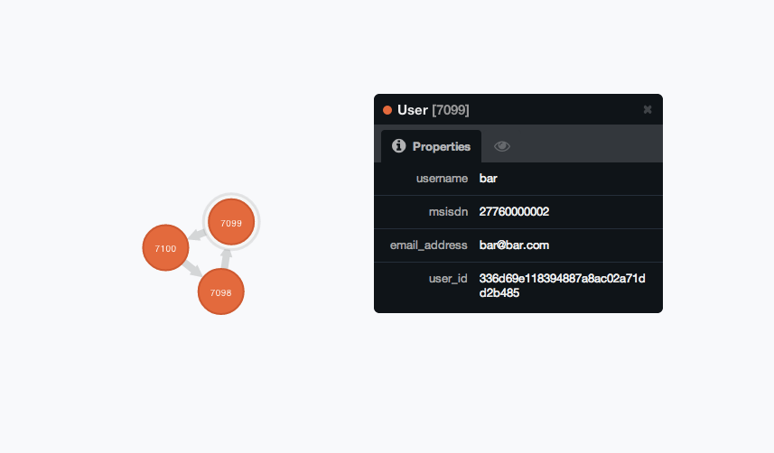

User Relationships
==================

.. http:put:: /users/(uuid:user_id_1)/relationship/(uuid:user_id_2)/

    Create a new relationship from `user_id_1` to `user_id_2`.

    :jsonparam string relationship_type:
        The type of relationship. Currently only `LIKE` is supported.
    :jsonparam dict relationship_props:
        The extra properties to be stored in this relationship.

    :resheader Content-Type: will always be `application/json`.
    :status 302: when update successful.
    :status 404: when `user_id_1` or `user_id_2` does not exist.

.. http:get:: /users/(uuid:user_id_1)/relationship/(uuid:user_id_2)/

    Get the relationship of `user_id_1` to `user_id_2`.

    :resheader Content-Type: will always be `application/json`
    :status 200: when a relationship exists.
    :status 404: when a relationship does not exist.

    .. sourcecode:: http

        HTTP/1.1 200 OK
        Vary: Accept
        Content-Type: application/json

        {
            "type": "LIKE"
            "data": {
                "kind": "comment"
            },
        }

Example with curl
~~~~~~~~~~~~~~~~~

::

    # Create user 1
    $ curl -X POST -v http://localhost:8081/users/ \
        -d '{
        "msisdn": "27760000001",
        "username": "foo",
        "email_address": "foo@foo.com"}'

    # redirects to created user with id `87e8da17eea541ed92bd861658d7e85e`

    # Create user 2
    $ curl -X POST -v http://localhost:8081/users/ \
        -d '{
        "msisdn": "27760000002",
        "username": "bar",
        "email_address": "bar@bar.com"}'

    # redirects to created user with id `336d69e118394887a8ac02a71dd2b485`

    # Create user 3
    $ curl -X POST -v http://localhost:8081/users/ \
        -d '{
        "msisdn": "27760000003",
        "username": "baz",
        "email_address": "baz@baz.com"}'

    # redirects to created user with id `e9b3d9e454c34516a318357fdfe04a6f`

    # User 1 likes a comment by User 2
    $ curl -X PUT -v http://localhost:8081/users/87e8da17eea541ed92bd861658d7e85e/relationship/336d69e118394887a8ac02a71dd2b485/ \
        -d '{
                "relationship_type": "LIKE",
                "relationship_props": {
                    "kind": "comment"
                }
            }'

    # User 2 likes a comment by User 3
    $ curl -X PUT -v http://localhost:8081/users/336d69e118394887a8ac02a71dd2b485/relationship/e9b3d9e454c34516a318357fdfe04a6f/ \
        -d '{
                "relationship_type": "LIKE",
                "relationship_props": {
                    "kind": "comment"
                }
            }'

    # User 3 likes a comment by User 1
    $ curl -X PUT -v http://localhost:8081/users/e9b3d9e454c34516a318357fdfe04a6f/relationship/87e8da17eea541ed92bd861658d7e85e/ \
        -d '{
                "relationship_type": "LIKE",
                "relationship_props": {
                    "kind": "comment"
                }
            }'

This creates the following users and relationships:

